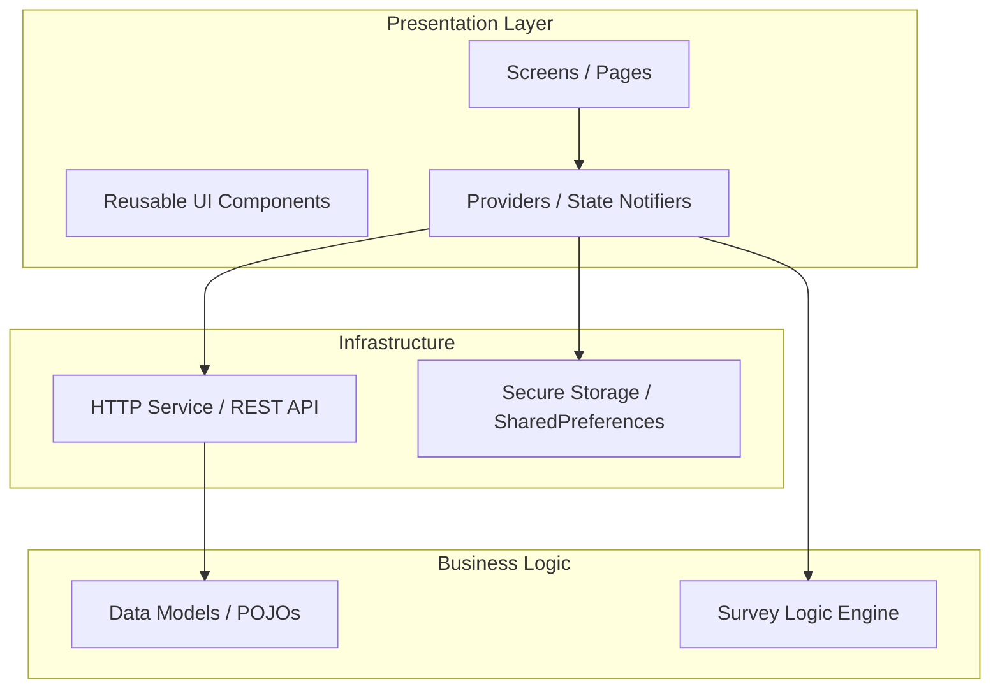

# SIS WDU Mobile - Architecture Plan

## 1. Executive Summary
SIS WDU Mobile is a field data collection application designed for enumerators to conduct surveys efficiently. The application focuses on **Dynamic Survey Rendering**, **Offline-first Logic Evaluation**, and **Secure API Integration** with the SIS WDU Laravel backend.

## 2. Technical Stack
- **Framework**: Flutter (Dart)
- **State Management**: `provider` (Recommended for its simplicity and efficiency in form-heavy apps) or `flutter_bloc`.
- **API Client**: `http` (Standard) with a custom wrapper for interceptors and error handling.
- **Storage**:
    - `shared_preferences`: Persistent settings and simple flags.
    - `flutter_secure_storage`: Sensitive data like Auth Tokens (JWT).
- **Styling**: Vanilla Flutter Widgets with a focused design system (Google Fonts: *Inter* or *Outfit* for a premium feel).

## 3. High-Level Architecture
We follow a **Clean Architecture** approach adapted for Flutter:



## 4. Key Modules

### A. Dynamic Survey Engine
- **Parser**: Converts JSON survey templates from the Laravel backend into Dart objects.
- **Renderer**: A recursive or list-based builder that maps question types (Text, Multi-choice, Matrix) to specific Flutter widgets.
- **Logic Evaluator**: A dedicated class to evaluate visibility/skip logic based on current responses without hitting the server.

### B. Authentication & Session
- **Secure Token Management**: Using `flutter_secure_storage` for the Bearer Token.
- **Auto-login**: Splash screen logic to check token validity and redirect to Dashboard or Login.

### C. Submission Handler
- **Drafting**: Auto-saves current progress to local storage to prevent data loss.
- **Payload Builder**: Transforms form state into the specific JSON format expected by the Laravel API.

## 5. Repository Structure (Refined)
```text
/lib
  /core
    /api          # API Client & Interceptors
    /constants    # App constants, API endpoints
    /theme        # Global styles & colors
    /utils        # SharedPreferences & SecureStorage helpers
  /models         # Data classes (from_json, to_json)
  /providers      # State management (Auth, Survey, UI)
  /screens        # Page widgets (login_screen.dart, dashboard_screen.dart)
  /services       # Logic for API calls and Business rules
  /widgets        # Reusable UI (survey_input.dart, custom_button.dart)
```

## 6. Logic Strategy (Offline Evaluation)
The app will pre-load "Question Logic" rules. When an enumerator answers a question:
1. The `SurveyProvider` triggers the `LogicEvaluator`.
2. The evaluator updates the `visibility` state of subsequent questions.
3. The UI re-renders instantly, providing a seamless experience.

## 7. Deployment & Environment
- **Target**: Internal APK distribution.
- **Environment**: `.env` files managed via `flutter_dotenv` or `dart-define` for switching between Staging and Production.
